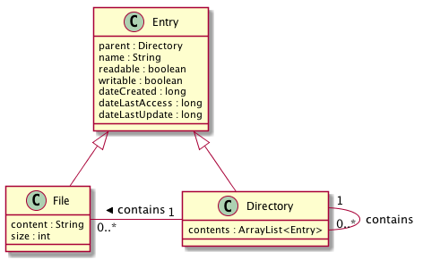

# File System App

Clone this project and then run it with following command:

```
javac FileSystemApp.java && java FileSystemApp
```

You can use the provided Makefile to compile and run the application. On the command line, for compiling:

```
make compile
```

For compiling and running just type:

```
make run
```

## Class Diagram


